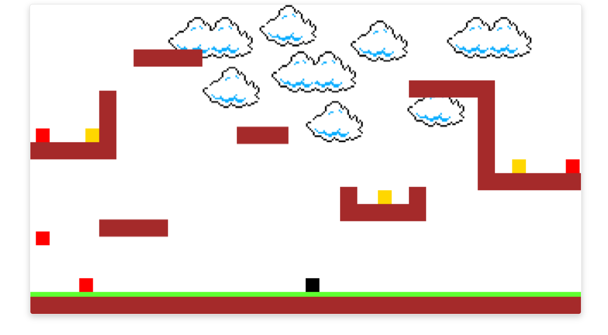

# 2D Scroller Engine



## Overview

A classic 2D game engine written in TypeScript.  Mimics all the essential moves in classics such as Mario Brothers including walking, running, jumping, wall-jumping, and more.

The demo includes autonomous _baddies_ which walk around a prescribed path.  You can interact with them by impacting their path or walking & jumping on top of them.  Collision detection uses a simple bounding box algorithm.

The engine cycles through a set of _frames_ as the characters move around allowing you to easily strap some sprites to add a real game feel to it.  It distinguishes between a stopped state, jumping, and walking/running.

## Build

As with any other TypeScript project, you need `nodejs` (preferrably v12+).  You build using:

```sh
$ npm install
$ npm start
```
